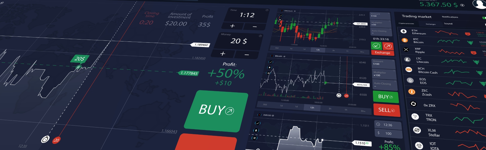

# Machine Learning Trading Bot - Optional

In this Challenge, I have assumed the role of a financial advisor at one of the top five financial advisory firms in the world. My firm constantly competes with the other major firms to manage and automatically trade assets in a highly dynamic environment. In recent years, my firm has heavily profited by using computer algorithms that can buy and sell faster than human traders.

The speed of these transactions gave my firm a competitive advantage early on. But, people still need to specifically program these systems, which limits their ability to adapt to new data. I am planning to improve the existing algorithmic trading systems and maintain the firm’s competitive advantage in the market. I will enhance the existing trading signals with machine learning algorithms that can adapt to new data.

### I have created the following 

* Implemented an algorithmic trading strategy that uses machine learning to automate the trade decisions.

* Adjusted the input parameters to optimize the trading algorithm.

* Trained a new machine learning model and compare its performance to that of a baseline model.

#### Establish a baseline performance and tune the baseline algorithm 

* Baseline cumulative return plot that shows the actual returns vs. the strategy returns
* SVC Model cumulative return plot that shows the actual returns vs. the strategy returns. Inputs are short_windows = 4, long_window = 100, DateOffset for training slice = 3 months.

![[returns_actual_vs_strategy]](https://github.com/apfreeman/Unit-15-Machine-Learning-Trading-Bot/blob/main/Images/returns_actual_vs_strategy_svm.PNG?raw=true)

- Classification Report

![[cr]](https://github.com/apfreeman/Unit-15-Machine-Learning-Trading-Bot/blob/main/Images/cr_svm_3_100.PNG?raw=true)

#### Slice the training dataset into different time periods in order to tune the model by adjusting the dataset size.  Change one of both window sizes in order to tune the model by adjusting the SMA input features.

* SVC Model cumulative return plot that shows the actual returns vs. the strategy returns. Inputs are short_windows = 8, long_window = 200, DateOffset for training slice = 6 months.

![[returns_actual_vs_strategy_6months]](https://github.com/apfreeman/Unit-15-Machine-Learning-Trading-Bot/blob/main/Images/returns_actual_vs_strategy_svm_6_200.PNG?raw=true)

- Classification Report

![[cr]](https://github.com/apfreeman/Unit-15-Machine-Learning-Trading-Bot/blob/main/Images/cr_svm_6_200.PNG?raw=true)

* SVC Model cumulative return plot that shows the actual returns vs. the strategy returns. Inputs are short_windows = 16, long_window = 400, DateOffset for training slice = 12 months.

 ![[returns_actual_vs_strategy_12months]](https://github.com/apfreeman/Unit-15-Machine-Learning-Trading-Bot/blob/main/Images/returns_actual_vs_strategy_svm_12_400.PNG?raw=true)

- Classification Report

![[cr]](https://github.com/apfreeman/Unit-15-Machine-Learning-Trading-Bot/blob/main/Images/cr_svm_12_400.PNG?raw=true)

#### Evaluate a new machine learning classifier 

* XGBoost Model cumulative return plot that shows the actual returns vs. the strategy returns. Inputs are short_windows = 4, long_window = 100, DateOffset for training slice = 3 months.

![[returns_actual_vs_strategy_xgboost]](https://github.com/apfreeman/Unit-15-Machine-Learning-Trading-Bot/blob/main/Images/returns_actual_vs_strategy_xgboost.PNG?raw=true)

- Classification Report

![[cr]](https://github.com/apfreeman/Unit-15-Machine-Learning-Trading-Bot/blob/main/Images/cr_xgboost_3_100.PNG?raw=true)

### Summary of findings

Predictions using SVC along side XGboost have been modelled. 

It is very evident that the SVC model is not useful at all with short_windows = 4, 16, long_window = 100, 400, DateOffset for training slice = 3 and 12 months. 

You can see by the results experimenting with these produced poor results. 

The optimal data set size and short and long window size that I tested with was.

 - SVM Model
 - Short Window Size = 8
 - Long Window Size = 200
 - Date Offset = 6 monts

 These parameters produces the best accuracy score. 

 It is worth noting however that the XGboost model, using the defualt 4,100, 6month parameters was not far behind in accuracy and was significantly better than the baseline model.